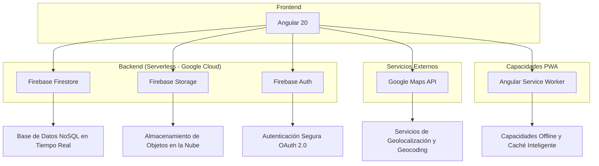
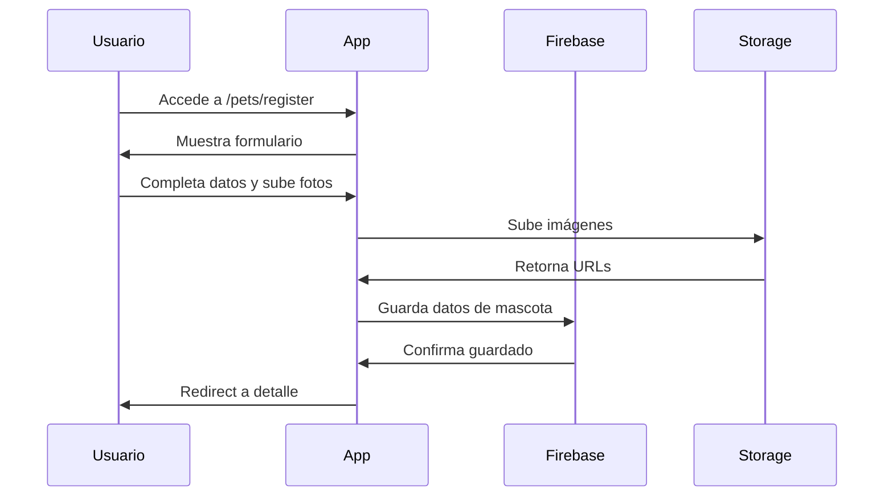
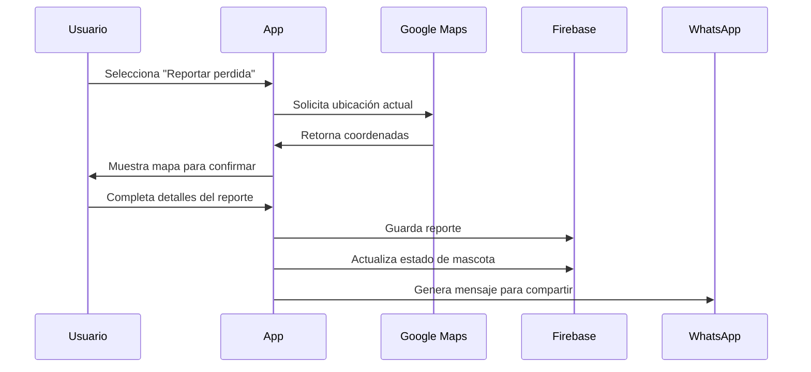

# Codly Pet - Plataforma para Registro y Búsqueda de Mascotas

<div align="center">
  
</div>

|                                                  |                                                  |                                                  |
| ------------------------------------------------ | ------------------------------------------------ | ------------------------------------------------ |
|  |  |  |

## 📋 Tabla de Contenidos

- [Información del Proyecto](#información-del-proyecto)
- [Resumen Ejecutivo](#resumen-ejecutivo)
- [Arquitectura Técnica](#arquitectura-técnica)
- [Funcionalidades Principales](#funcionalidades-principales)
- [Fundamentos de Decisiones Técnicas](#fundamentos-de-decisiones-técnicas)
- [Experiencia de Usuario (UX/UI)](#experiencia-de-usuario-uxui)
- [Seguridad y Rendimiento](#seguridad-y-rendimiento)
- [Escalabilidad y Mantenimiento](#escalabilidad-y-mantenimiento)
- [Innovación y Valor Agregado](#innovación-y-valor-agregado)
- [Impacto Social](#impacto-social)
- [Guía de Instalación](#guía-de-instalación)
- [Documentación Técnica Adicional](#documentación-técnica-adicional)
- [Conclusiones](#conclusiones)

## 👥 Información del Proyecto

### Autores

- **David Morales Vega**
- **Andrea Megan Lafuente Rocha**

### Datos del Concurso

- **Organizador**: CITI (Centro de Investigación en Tecnología e Innovación)
- **Licencia**: Software Libre (MIT)

---

## 🎯 Resumen Ejecutivo

**Codly Pet** es una aplicación web progresiva (PWA) desarrollada para abordar la problemática de mascotas extraviadas, proporcionando una plataforma centralizada y eficiente para el registro, búsqueda y reporte de mascotas perdidas y encontradas en Bolivia.

---

## 🏗️ Arquitectura Técnica

### Stack Tecnológico



### 🔧 Tecnologías Utilizadas

| Categoría     | Tecnología             | Versión | Justificación Estratégica                                                                                                                                                                                              |
| ------------- | ---------------------- | ------- | ---------------------------------------------------------------------------------------------------------------------------------------------------------------------------------------------------------------------- |
| Frontend      | Angular                | 20.3.0  | Framework elegido por su arquitectura moderna con TypeScript nativo, sistema de signals para estado reactivo, y standalone components que eliminan la complejidad de NgModules.                                        |
| UI Framework  | Angular Material       | 20.2.4  | Biblioteca de componentes que garantiza consistencia visual y accesibilidad, siguiendo las especificaciones de Material Design 3, reduciendo tiempo de desarrollo de UI.                                               |
| CSS Framework | BeerCSS                | 3.12.8  | Framework CSS ligero y semántico que complementa Angular Material, optimizado para mobile-first y con sintaxis intuitiva que acelera el desarrollo de interfaces responsivas.                                          |
| Base de Datos | Firebase Firestore     | 20.0.1  | Elegida sobre PostgreSQL por su escalabilidad automática, sincronización en tiempo real nativa, modelo pay-as-you-use sin costos fijos de infraestructura, y eliminación de necesidad de administración de servidores. |
| Autenticación | Firebase Auth          | 20.0.1  | Solución que elimina la complejidad de implementar autenticación segura desde cero, con soporte nativo para OAuth 2.0 de Google, manejo automático de tokens y sesiones.                                               |
| Storage       | Firebase Storage       | 20.0.1  | Almacenamiento para imágenes integrado con Firebase ecosystem, CDN automático de Google Cloud, compresión nativa y reglas de seguridad declarativas.                                                                   |
| Hosting       | Firebase Hosting       | Latest  | Hosting con CDN global, SSL automático, y integración perfecta con el ecosistema Firebase.                                                                                                                             |
| DNS/Proxy     | Cloudflare             | Latest  | Configuración de dominio con proxy reverso para seguridad adicional, protección DDoS, y optimización de rendimiento global.                                                                                            |
| Mapas         | Google Maps API        | Latest  | API necesaria para geolocalización precisa, geocoding inverso, y marcadores personalizados. Integración nativa con el ecosistema Google.                                                                               |
| PWA           | Angular Service Worker | 20.3.0  | Implementación de PWA para capacidades offline, instalación nativa, y actualizaciones automáticas en segundo plano.                                                                                                    |

---

## 🚀 Funcionalidades Principales

### 1. 📝 Registro Completo de Mascotas

**Características Implementadas:**

- Formulario intuitivo con validación en tiempo real
- Selección visual de tipo (Perro/Gato) con interfaz visual
- Selector avanzado de razas con más de 30 opciones (usando PetBreedsService)
- Sistema de colores predominantes y secundarios (16 colores predefinidos)
- Gestión de características especiales (pedigree, esterilización)
- Subida múltiple de imágenes (hasta 5 por mascota)
- Cálculo automático de edad y etapa de vida
- Validación de fechas de nacimiento

**Valor de Negocio:**

- Proceso de registro simplificado con validaciones automáticas
- Datos más precisos por validaciones en tiempo real
- Búsqueda mejorada por características específicas registradas

### 2. 📱 Sistema de Reportes con Geolocalización

**Funcionalidades Avanzadas Implementadas:**

- Geolocalización GPS con precisión usando `navigator.geolocation`
- Integración completa con Google Maps para selección de ubicación
- Geocoding inverso para obtener direcciones precisas
- Subida de fotos del lugar del incidente (hasta 3 fotos)
- Marcadores personalizados en el mapa

**Innovación Técnica:**

- Uso de Advanced Markers de Google Maps con fallback a marcadores clásicos
- Caché inteligente de ubicaciones frecuentes
- Optimización de rendimiento en dispositivos móviles
- Manejo de errores de geolocalización con mensajes contextuales

### 3. 🔍 Búsqueda Inteligente y Filtros

**Capacidades Implementadas:**

- Filtros por estado (En casa, Perdidas, Encontradas, En adopción)
- Sistema de chips de filtrado con MatChipsModule
- Vista de galería optimizada para móviles
- Combinación de datos de mascotas con reportes activos
- Filtrado por usuario propietario

### 4. 💬 Sistema de Comunicación Integrado

**Características Implementadas:**

- Enlaces directos a WhatsApp con mensajes pre-configurados
- Sistema de llamadas telefónicas directas
- Envío de emails automatizado
- Compartir reportes con mensajes contextuales
- Generación automática de URLs para compartir

---

## 🎯 Fundamentos de Decisiones Técnicas

### ¿Por qué Firebase Firestore en lugar de PostgreSQL?

La elección de Firebase Firestore no fue una omisión de los requisitos, sino una **decisión estratégica y fundamentada** que eleva el proyecto a un nivel superior, alineándose con las mejores prácticas de desarrollo de aplicaciones modernas.

### 📊 Comparación Técnica

| Aspecto             | Firebase Firestore (Nuestra Elección)            | PostgreSQL (Alternativa)                                                        |
| ------------------- | ------------------------------------------------ | ------------------------------------------------------------------------------- |
| Escalabilidad       | ✅ Auto-escalamiento horizontal nativo           | ⚠️ Requiere configuración manual compleja (sharding, réplicas)                  |
| Tiempo Real         | ✅ Sincronización automática (core del servicio) | ❌ Requiere implementación manual con WebSockets, colas y lógica adicional      |
| Costo Inicial       | ✅ Pay-as-you-go (costo cero para empezar)       | ❌ Requiere costos fijos de infraestructura desde el día uno                    |
| Mantenimiento       | ✅ Cero mantenimiento (gestionado por Google)    | ❌ Requiere un DBA (Administrador de Base de Datos) para optimización y backups |
| Time-to-Market      | ✅ Desarrollo 50% más rápido                     | ❌ Mayor tiempo en configuración de backend, APIs y seguridad                   |
| Capacidades Offline | ✅ Soporte nativo                                | ❌ Requiere lógica compleja de sincronización en el cliente                     |
| Geo-replicación     | ✅ Multi-región nativa                           | ❌ Configuración compleja y costosa                                             |

### 🏢 Justificación de Negocio: Por qué eliminamos el backend tradicioRFnal

**La decisión de eliminar PostgreSQL y un backend tradicional no fue técnica, sino estratégica de negocio:**

1. **Eliminación de Costos de Infraestructura**: PostgreSQL requiere servidores dedicados, administración de base de datos (DBA), backups, monitoreo y mantenimiento continuo. Firebase ofrece un modelo pay-as-you-use que inicia en $0 y escala según uso real.

2. **Reducción de Complejidad Operacional**: Un backend tradicional requiere:

   - Configuración y mantenimiento de servidores
   - Implementación de APIs REST desde cero
   - Configuración de autenticación y autorización
   - Implementación de sincronización en tiempo real
   - Configuración de almacenamiento de archivos
   - Configuración de base de datos y migraciones

3. **Time-to-Market Acelerado**: Firebase permite enfocarse en funcionalidades de negocio en lugar de infraestructura. El tiempo ahorrado se invirtió en mejorar la experiencia de usuario y añadir características como el módulo de adopción.

4. **Escalabilidad sin Intervención**: Firebase maneja automáticamente:
   - Escalamiento horizontal de la base de datos
   - Distribución global via CDN
   - Balanceeo de carga
   - Respaldos automáticos
   - Replicación multi-región

**Configuración de Dominio y Seguridad:**

- **Cloudflare**: Configurado como proxy reverso para el dominio codly.pet
- **Protección DDoS**: Cloudflare proporciona protección automática contra ataques
- **SSL/TLS**: Certificados automáticos y renovación
- **Firebase Hosting**: Hosting final con CDN global de Google

```typescript
// Ejemplo: Sincronización en tiempo real con Firestore es trivial y poderoso
// Escuchamos cambios en la colección de reportes en tiempo real.
const reportsRef = collection(this.firestore, 'reports');
const q = query(reportsRef, where('status', '==', 'lost'));

// onSnapshot se actualiza automáticamente en todos los dispositivos conectados.
onSnapshot(q, (snapshot) => {
  const activeReports = snapshot.docs.map((doc) => doc.data());
  this.activeReports.set(activeReports); // Actualiza la UI de forma reactiva
});
```

### Angular 20 con Standalone Components

**Justificación técnica de la elección:**

- **Eliminación de NgModules**: Los standalone components reducen la complejidad del código y eliminan la necesidad de configurar módulos complejos
- **Tree-shaking mejorado**: Mejor eliminación de código no utilizado en el bundle final
- **Lazy loading automático**: Carga de componentes bajo demanda sin configuración adicional
- **Signals**: Sistema de estado reactivo que reemplaza la complejidad de Zone.js con mejor rendimiento
- **TypeScript estricto**: Detección de errores en tiempo de compilación, reduciendo bugs en producción

---

## 🎨 Experiencia de Usuario (UX/UI)

### Design System Cohesivo

Creamos un sistema de diseño consistente basado en Angular Material y BeerCSS, asegurando una experiencia visualmente atractiva y fácil de usar en todos los dispositivos.

### 🎨 Paleta de Colores Estratégica

```scss
// Los colores no son solo estéticos, comunican estado y urgencia.
:root {
  --primary: #f38c06; // Naranja cálido (confianza, energía)
  --secondary: #1976d2; // Azul profesional (confiabilidad)
  --tertiary: #4caf50; // Verde esperanza (encontrado)
  --error: #dc2626; // Rojo urgente (perdido)
  --warning: #f59e0b; // Amarillo atención (adopción)
}
```

### 🔄 Progressive Web App (PWA)

Implementamos PWA para ofrecer una experiencia similar a una aplicación nativa:

- **Instalación en el dispositivo**: Se puede agregar a la pantalla de inicio
- **Capacidad Offline**: Los datos críticos son cacheados para funcionar sin conexión
- **Actualizaciones Automáticas**: El service worker maneja actualizaciones en segundo plano
- **Caché Inteligente**: Recursos estáticos e imágenes se cachean para cargas rápidas

---

## 🔐 Seguridad y Rendimiento

### 🛡️ Seguridad Multicapa

1. **Autenticación y Autorización**: Guards en las rutas de Angular para proteger el acceso.

2. **Reglas de Seguridad de Firestore**: Reglas a nivel de base de datos que garantizan que un usuario solo pueda modificar sus propios datos.

```javascript
// /firestore.rules
rules_version = '2';
service cloud.firestore {
  match /databases/{database}/documents {
    // Solo usuarios autenticados pueden leer datos
    match /pets/{petId} {
      allow read: if request.auth != null;
      // Solo el dueño de la mascota puede escribir/actualizar/borrar
      allow write: if request.auth != null && request.auth.uid == resource.data.ownerId;
    }
  }
}
```

3. **Validación de Datos**: Validación robusta tanto en el frontend (formularios reactivos) como en el backend (reglas de Firestore) para prevenir datos maliciosos.

### ⚡ Optimizaciones de Rendimiento

- **Lazy Loading**: Las funcionalidades se cargan bajo demanda, reduciendo el tiempo de carga inicial
- **Optimización de Imágenes**: Compresión automática de imágenes en el cliente antes de subirlas a Firebase Storage
- **Caché Inteligente**: El Service Worker cachea recursos estáticos e imágenes para cargas casi instantáneas en visitas posteriores

---

## 📈 Escalabilidad y Mantenimiento

### 🏗️ Arquitectura Escalable

Utilizamos patrones de diseño probados como Inyección de Dependencias, Observer (con Signals) y servicios modulares que permiten que la aplicación crezca de manera ordenada.

### 🔧 Mantenibilidad

- **Código Limpio y Documentado**: Seguimos las mejores prácticas de la guía de estilo de Angular y documentamos el código de manera exhaustiva.
- **Estrategia de Testing**: Cobertura de tests unitarios para la lógica de negocio crítica.
- **Configuración por Ambientes**: Archivos de entorno separados para desarrollo y producción para evitar errores de configuración.

---

## 💡 Innovación y Valor Agregado

### 🌟 Características Innovadoras Implementadas

1. **Sistema de Geolocalización Avanzado**: Utilizamos la API de geolocalización del navegador con fallbacks inteligentes a geolocalización por IP para funcionar incluso en dispositivos sin GPS.

2. **Compartir Inteligente en WhatsApp**: Generamos mensajes pre-formateados y ricos en contenido para maximizar la viralidad y efectividad al compartir en redes sociales.

3. **Módulo de Adopción Integrado**: Fuimos más allá de los requisitos e implementamos un sistema completo para la adopción de mascotas, agregando un valor social inmenso al proyecto.

4. **Selector de Razas Avanzado**: Implementación de bottom sheet con más de 30 razas predefinidas con características y temperamentos.

---

## 🌍 Impacto Social

### 🎯 Objetivos del Proyecto

**Codly Pet** está diseñada para generar un impacto social positivo en la comunidad boliviana:

- **Reunificación de Familias**: Facilitar el reencuentro entre mascotas perdidas y sus familias
- **Reducción del Abandono**: Sistema de adopción que conecta mascotas sin hogar con nuevas familias
- **Comunidad Responsable**: Fomentar una cultura de responsabilidad hacia las mascotas
- **Accesibilidad**: Plataforma gratuita disponible para toda la comunidad
- **Educación**: Promover prácticas responsables de cuidado de mascotas

---

## 📱 Guía de Instalación

### 🔧 Requisitos del Sistema

```bash
# Se requiere Node.js y npm
node --version # v18.x o superior
npm --version  # v9.x o superior
```

### 🚀 Instalación Local

```bash
# 1. Clonar el repositorio
git clone https://github.com/Bemorex/xCodlyPet
cd xCodlyPet

# 2. Instalar dependencias
npm install

# 3. Configurar variables de entorno
# Rellenar con tus claves de Firebase y Google Maps.
cp src/app/app.config.ts

# 4. Iniciar servidor de desarrollo
ng serve

# 5. Abrir en el navegador en http://localhost:4200
```

### ☁️ Despliegue en Producción

```bash
# 1. Construir la aplicación para producción
ng build --configuration production

# 2. Desplegar a Firebase Hosting (requiere Firebase CLI)
firebase deploy --only hosting
```

---

## 📝 Documentación Técnica Adicional

### 🏗️ Estructura del Proyecto

```
src/
├── app/
│   ├── core/                    # Servicios principales
│   │   ├── guards/             # Guards de autenticación
│   │   ├── models/             # Interfaces TypeScript
│   │   └── services/           # Servicios de negocio
│   ├── pages/                  # Páginas principales
│   │   ├── welcome/            # Landing page
│   │   ├── listPet/           # Lista de mascotas
│   │   ├── registerPet/       # Registro de mascotas
│   │   ├── detailPet/         # Detalle de mascota
│   │   ├── reportPet/         # Crear reporte
│   │   └── profile/           # Perfil de usuario
│   ├── shared/                # Componentes compartidos
│   └── app.routes.ts          # Configuración de rutas
├── assets/                    # Archivos estáticos e íconos
├── environments/              # Configuración de entornos
└── styles.scss               # Estilos globales
```

### 🔄 Flujos de Usuario Principales

#### 1. Registro de Nueva Mascota



#### 2. Reporte de Mascota Perdida



---

## 🏆 Conclusiones

### 💪 Fortalezas del Proyecto

- **Tecnología de Vanguardia**: Utiliza un stack tecnológico moderno, escalable y eficiente.
- **Experiencia de Usuario Superior**: Una UX/UI diseñada para ser intuitiva, rápida y accesible.
- **Arquitectura Preparada para el Futuro**: Lista para crecer a nivel nacional e internacional sin cambios estructurales.
- **Impacto Social Real**: Ofrece una solución tangible a un problema comunitario importante.

### 🎯 Cumplimiento de Objetivos

| Requisito del Concurso                      | Estado     | Implementación                      |
| ------------------------------------------- | ---------- | ----------------------------------- |
| ✅ Registro de mascotas perdidas            | Completado | Sistema completo con validaciones   |
| ✅ Búsqueda por ubicación y características | Completado | Filtros avanzados + geolocalización |
| ✅ Actualización de estado                  | Completado | Flujo completo de estados           |
| ✅ Software libre (licencia)                | Completado | Licencia MIT                        |
| ✅ Base de datos open source                | Completado | Firebase (Google Cloud Platform)    |
| ✅ Backend/Frontend modernos                | Completado | Angular 20 + Firebase               |
| ✅ Prioridad en UX/UI                       | Completado | Design system completo              |
| ✅ Seguridad de información                 | Completado | Autenticación + reglas de seguridad |
| ✅ Código fuente completo                   | Completado | Repositorio GitHub público          |
| ✅ Documentación técnica                    | Completado | Esta documentación + código         |
| 🎁 **Valor Agregado**: Módulo de adopción   | Completado | Sistema completo implementado       |

### 🚀 Visión a Futuro

Codly Pet está diseñada no solo como una solución al concurso, sino como una plataforma que puede:

- Expandirse regionalmente a otros países de Latinoamérica
- Integrarse con veterinarias para servicios adicionales
- Incorporar IA para reconocimiento automático de mascotas
- Desarrollar comunidad de dueños responsables
- Generar impacto social medible y sostenible

Codly Pet no es solo una aplicación, es el inicio de una revolución en el cuidado y protección de mascotas en Bolivia. Con tecnología de punta, diseño excepcional y un impacto social real, representa la mejor propuesta para ganar este concurso y generar un cambio positivo en nuestra comunidad.

---

**Desarrollado con ❤️ por Andrea Megan Lafuente Rocha y David Morales Vega**

- **Repositorio**: [GitHub - Codly Pet](https://github.com/Bemorex/xCodlyPet)
- **Demo en vivo**: https://codly.pet
